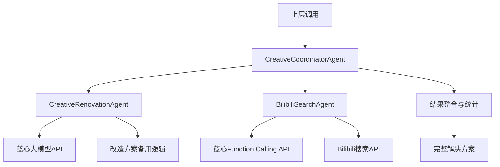

# 创意改造协调器Agent

智能协调创意改造步骤生成和Bilibili视频搜索，为用户提供完整的改造解决方案包，包含详细步骤指导和相关视频教程。

## 功能特性

### 🎯 核心功能
- **统一协调**: 协调调用创意改造Agent和Bilibili搜索Agent
- **完整方案**: 提供改造步骤 + 视频教程的完整解决方案
- **并行处理**: 支持并行执行以提高响应速度
- **智能整合**: 自动整合子Agent结果并生成统计信息

### 📊 输入方式
- **分析结果输入**: 接收上层传入的物品分析结果（包含category、condition、description等信息）

### 🔧 输出内容
- **改造方案**: 详细的改造步骤、工具材料、时间成本等
- **改造摘要**: 改造方案的概要信息和文本摘要
- **视频教程**: 相关的B站DIY教程视频列表
- **搜索信息**: 视频搜索关键词和搜索意图
- **统计数据**: 步骤数量、视频数量、成功率等统计信息

## 使用示例

```python
from app.agents.creative_coordinator import CreativeCoordinatorAgent

async def example_usage():
    # 准备物品分析结果
    analysis_result = {
        "category": "家具",
        "sub_category": "桌子",
        "condition": "八成新",
        "description": "一张旧木桌，表面有划痕但结构完好",
        "material": "木质",
        "color": "棕色",
        "keywords": ["桌子", "木质", "家具"]
    }
    
    async with CreativeCoordinatorAgent() as coordinator:
        # 生成完整解决方案（并行模式）
        solution = await coordinator.generate_complete_solution(
            analysis_result=analysis_result,
            max_videos=5,
            enable_parallel=True
        )
        
        if solution["success"]:
            print(f"处理模式: {solution['processing_mode']}")
            print(f"组件成功率: {solution['statistics']['components_success_rate']}")
            
            # 改造方案信息
            if solution.get("renovation_plan"):
                plan = solution["renovation_plan"]
                print(f"改造项目: {plan['project_title']}")
                print(f"步骤数量: {len(plan['steps'])}")
                print(f"改造摘要: {solution.get('renovation_summary_text', '')}")
            
            # 视频信息
            videos = solution.get("videos", [])
            print(f"相关视频: {len(videos)} 个")
            for video in videos[:3]:  # 显示前3个视频
                print(f"- {video['title']} ({video['uploader']})")
```

## 分析结果输入格式

```json
{
  "category": "物品类别（如：家具、电子产品等）",
  "sub_category": "子类别（如：桌子、椅子等）",
  "condition": "物品状态（如：全新、八成新、有磨损等）",
  "description": "物品详细描述",
  "material": "材质信息（可选）",
  "color": "颜色信息（可选）",
  "keywords": ["关键词列表"],
  "special_features": "特殊特征（可选）"
}
```

## 完整解决方案结构

```json
{
  "success": true,
  "source": "coordinator",
  "processing_mode": "parallel|sequential",
  "analysis_result": { /* 原始分析结果 */ },
  "components": {
    "renovation": {
      "success": true,
      "source": "ai_model|fallback"
    },
    "video_search": {
      "success": true,
      "source": "function_calling|fallback"
    }
  },
  "renovation_plan": {
    "project_title": "改造项目标题",
    "project_description": "改造项目整体描述",
    "difficulty_level": "简单|中等|困难",
    "steps": [
      {
        "step_number": 1,
        "title": "步骤标题",
        "description": "详细操作描述",
        "tools_needed": ["所需工具"],
        "materials_needed": ["所需材料"],
        "estimated_time_minutes": 30,
        "difficulty": "难度等级"
      }
    ],
    "final_result": { /* 最终成品信息 */ }
  },
  "renovation_summary": {
    "project_title": "项目标题",
    "difficulty_level": "难度等级",
    "total_steps": 5,
    "total_time": "2小时",
    "total_cost": "50-100元"
  },
  "renovation_summary_text": "改造方案的文本摘要",
  "videos": [
    {
      "title": "视频标题",
      "uploader": "UP主名称",
      "url": "视频链接",
      "cover_url": "封面图片",
      "play_count": 1000,
      "duration": "10:30",
      "description": "视频描述"
    }
  ],
  "video_keywords": ["搜索关键词"],
  "search_intent": "搜索意图描述",
  "video_total": 25,
  "statistics": {
    "total_steps": 5,
    "video_count": 3,
    "has_renovation_plan": true,
    "has_videos": true,
    "components_success_rate": 1.0
  }
}
```

## 处理模式

### 🚀 并行处理模式（推荐）
- **优势**: 响应速度快，充分利用系统资源
- **适用**: 大部分场景，特别是对响应时间有要求的情况
- **特点**: 同时执行改造步骤生成和视频搜索

### 🔄 串行处理模式
- **优势**: 资源占用少，错误处理简单
- **适用**: 系统资源有限或需要严格控制执行顺序的场景
- **特点**: 按顺序执行，先生成改造步骤再搜索视频

## 组件状态检查

```python
# 检查子Agent初始化状态
status = coordinator.get_component_status()
print(f"已初始化: {status['initialized']}")
```

## 错误处理机制

### 🛡️ 容错设计
- **局部失败容忍**: 一个子Agent失败不影响另一个的执行
- **异常隔离**: 并行模式下异常不会相互影响
- **降级服务**: 部分功能失败时仍能提供可用的服务

### 📋 错误类型
- `coordinator_validation`: 输入验证失败
- `coordinator_error`: 协调器本身错误
- `renovation_parallel_error`: 改造Agent并行执行异常
- `video_search_parallel_error`: 视频搜索Agent并行执行异常
- `coordinator_processing_error`: 结果处理失败

## 性能特性

### ⚡ 性能优化
- **并行执行**: 支持改造步骤生成和视频搜索并行处理
- **懒加载**: 子Agent延迟初始化，减少启动时间
- **资源复用**: 合理管理HTTP连接等资源
- **异步设计**: 全异步架构，提高并发处理能力

### 📊 性能指标
- **并行模式**: 相比串行模式可节省30-50%的响应时间
- **资源效率**: 智能的资源管理和清理机制
- **成功率**: 内置多重备用机制，确保高可用性

## 集成架构



## 测试

```bash
# 运行完整测试套件
pytest tests/agents/creative_coordinator/

# 运行简单测试
python tests/agents/creative_coordinator/test_agent.py
```

## 依赖模块

- `app.agents.creative_renovation`: 创意改造步骤Agent
- `app.agents.bilibili_search`: Bilibili搜索Agent
- `app.core.logger`: 日志记录
- `asyncio`: 异步并发处理

## 最佳实践

### 🎯 使用建议
1. **优先并行模式**: 除非有特殊需求，建议使用并行处理模式
2. **合理设置视频数量**: 根据实际需求设置max_videos参数，避免过多无关视频
3. **异常处理**: 正确处理各种异常情况，提供降级服务
4. **资源管理**: 使用异步上下文管理器确保资源正确释放

### ⚠️ 注意事项
1. **API依赖**: 需要配置有效的蓝心大模型API密钥
2. **网络环境**: 确保能正常访问Bilibili和蓝心API
3. **并发限制**: 注意API调用频率限制，避免触发限流
4. **内存使用**: 大量视频数据可能占用较多内存
5. **超时设置**: 合理设置各子Agent的超时时间

## 扩展性

### 🔧 可扩展功能
- **新增Agent**: 可轻松集成其他功能Agent
- **自定义处理**: 支持自定义结果处理逻辑
- **配置化**: 支持通过配置调整各种参数
- **监控集成**: 可集成性能监控和统计功能 